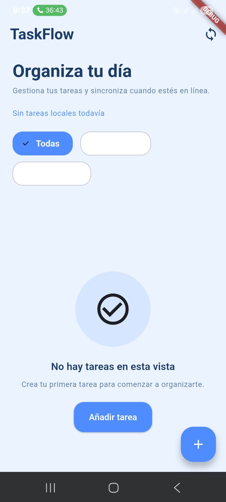
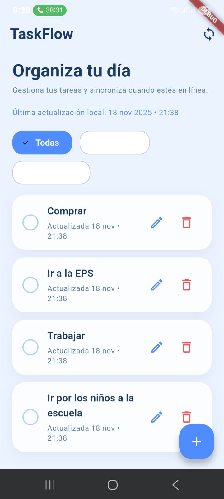
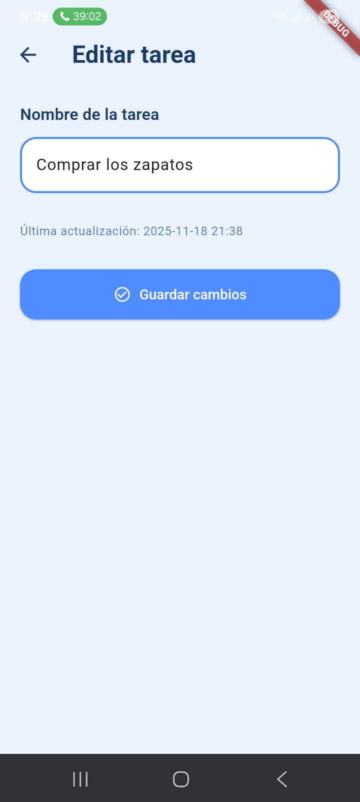
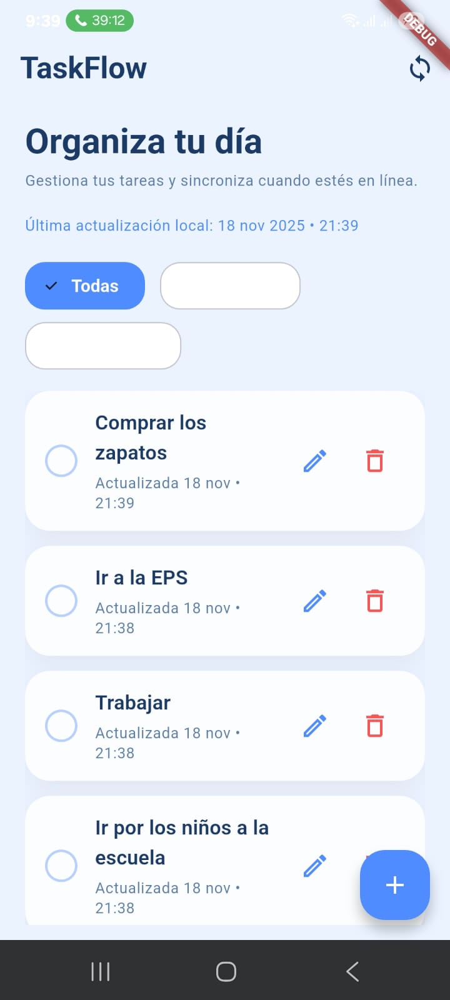
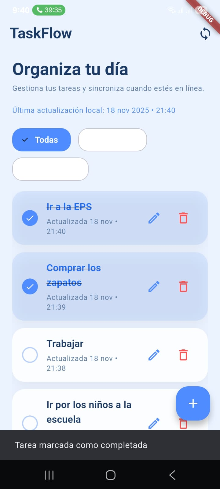
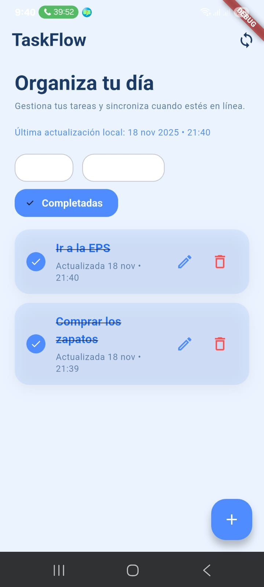
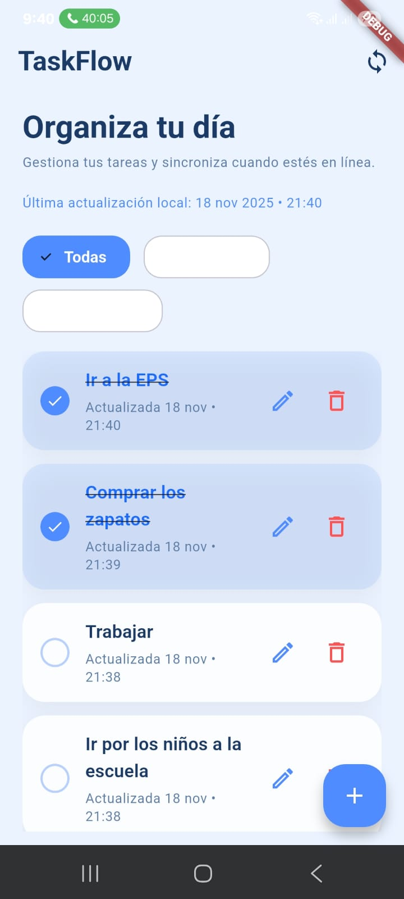
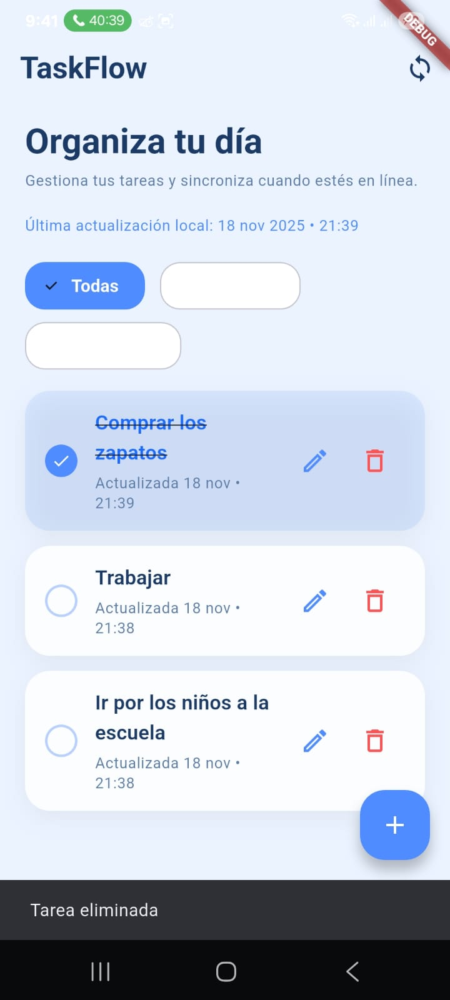
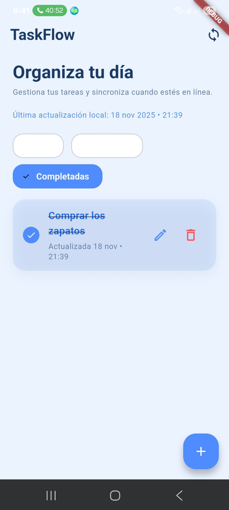
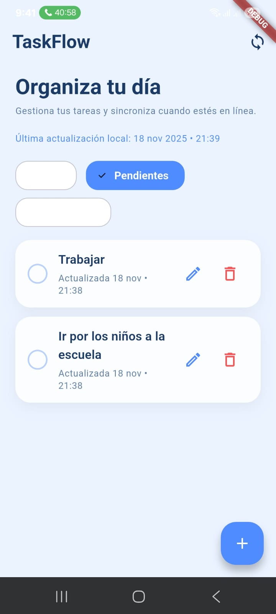

# TaskFlow · Gestores de estado y persistencia local

**Estudiante:** Angie Natalia Cobo Vasquez  
**Código:** 230222011

Aplicación To-Do desarrollada con Flutter 3.x que combina Riverpod, SQLite y un backend REST para ofrecer una experiencia offline-first con sincronización automática.

## 🚀 Entregables Completados

### APK Generado Correctamente
- **Ubicación:** `build\app\outputs\flutter-apk\app-release.apk` (46.5MB)
- El APK está listo para ser compartido.

### Documentación en README.md
- Incluye arquitectura, guía de API, capturas de pantalla y pruebas de sincronización.

### Código Fuente
- Implementa Riverpod, SQLite, sincronización offline y manejo de errores.
- Backend en Node.js/Express con persistencia en memoria.
- Estrategia de resolución de conflictos Last-Write-Wins (LWW).

> 💡 **Screenshots**: las capturas utilizadas en este README se encuentran en `lib/imgs/`.

---

## Tabla de contenidos

1. [Objetivo del proyecto](#objetivo-del-proyecto)
2. [Características clave](#características-clave)
3. [Arquitectura y gestión de estado](#arquitectura-y-gestión-de-estado)
4. [Estructura de carpetas](#estructura-de-carpetas)
5. [Capturas de pantalla](#capturas-de-pantalla)
6. [Requisitos previos](#requisitos-previos)
7. [Configuración y ejecución](#configuración-y-ejecución)
8. [Configuración de la API](#configuración-de-la-api)
9. [Persistencia local y modo offline](#persistencia-local-y-modo-offline)
10. [Flujo de sincronización](#flujo-de-sincronización)
11. [Pruebas manuales sugeridas](#pruebas-manuales-sugeridas)
12. [Generación de APK](#generación-de-apk)
13. [Convenciones de Git y GitFlow](#convenciones-de-git-y-gitflow)
14. [Roadmap y pendientes](#roadmap-y-pendientes)

---

## Objetivo del proyecto

Evaluar la implementación de una app móvil moderna que:

- Utiliza **Flutter** con arquitectura por capas y **Riverpod** para la gestión de estado.
- Integra una **API REST** para mantener las tareas sincronizadas con un backend.
- Persiste la información en **SQLite** empleando una estrategia **offline-first**.
- Sigue buenas prácticas de documentación, control de versiones y despliegue.

---

## Características clave

- CRUD completo de tareas (crear, editar, marcar como completadas y eliminar).
- Filtros rápidos por estado: *Todas*, *Pendientes* y *Completadas*.
- Persistencia local con **sqflite** y abstracciones `Dao` para el acceso a datos.
- Cola de operaciones (`queue_operations`) con backoff exponencial para reintentos y marca `synced_at` para auditoría.
- Detección de conectividad continua con `connectivity_plus` para disparar sincronizaciones automáticas al volver a tener red.
- API REST consumida mediante `dio`, soportando cabeceras de idempotencia.
- UI adaptada a Material 3 con mensajes claros de error y confirmaciones.

---

## Arquitectura y gestión de estado

```
 ┌──────────────────────────────────────────────────────────┐
 │                        Presentación                      │
 │  (UI + Widgets)                                          │
 │   └─ Riverpod Consumers                                  │
 └──────────────────────────────────────────────────────────┘
                ▲                          │
                │                          ▼
 ┌──────────────────────────────────────────────────────────┐
 │                         Providers                        │
 │  - apiBaseProvider, apiClientProvider                    │
 │  - tasksRepositoryProvider, syncServiceProvider          │
 └──────────────────────────────────────────────────────────┘
                ▲                          │
                │                          ▼
 ┌──────────────────────────────────────────────────────────┐
 │                         Dominio                          │
 │  - Interfaces de repositorio                             │
 └──────────────────────────────────────────────────────────┘
                ▲                          │
                │                          ▼
 ┌──────────────────────────────────────────────────────────┐
 │                          Data                            │
 │  Local: SQLite (TasksDao, QueueDao)                      │
 │  Remoto: API REST (TasksApi)                             │
 │  Repositorio: TasksRepositoryImpl                        │
 └──────────────────────────────────────────────────────────┘

```

La sincronización es coordinada por `SyncService`, que consume las operaciones encoladas y mantiene alineados los datos locales y remotos siguiendo la estrategia **Last-Write-Wins (LWW)**.@d:/taskflow/lib/src/services/sync_service.dart#12-112

---

## Estructura de carpetas

```
taskflow/
├─ lib/
│  ├─ main.dart
│  └─ src/
│     ├─ config/
│     ├─ data/
│     │  ├─ local/
│     │  ├─ remote/
│     │  └─ repositories/
│     ├─ domain/
│     ├─ models/
│     ├─ providers/
│     ├─ services/
│     └─ ui/
├─ docs/
│  └─ screenshots/   # Guardar aquí las imágenes del README
├─ android/ ios/ linux/ macos/ web/ windows/
└─ pubspec.yaml
```

---

## Capturas de pantalla

| Estado | Pantalla |
| --- | --- |
| Vista inicial sin tareas |  |
| Lista completa (todas las tareas) |  |
| Formulario de edición de tarea |  |
| Lista con tarea actualizada |  |
| Tarea marcada como completada (snackbar) |  |
| Varias tareas completadas |  |
| Filtro de pendientes |  |
| Filtro de completadas |  |
| Vista de todas tras completar |  |
| Eliminación de tarea (snackbar) |  |
| Completadas tras eliminar |  |
| Pendientes tras eliminar |  |

> Nombrar las imágenes según la tabla anterior o ajustar las rutas en el README.

---

## Requisitos previos

- Flutter 3.x (`flutter --version` para verificar).
- Android Studio o VS Code con extensiones de Flutter/Dart.
- Dispositivo o emulador Android/iOS.
- Backend REST disponible (json-server, Node, .NET, etc.).

---

## Configuración y ejecución

```bash
flutter pub get
flutter run
```

Parámetros relevantes en `pubspec.yaml`:

- `flutter_riverpod`
- `sqflite` / `sqflite_common_ffi_web`
- `dio`
- `connectivity_plus`
- `uuid`

Los providers principales se declaran en `lib/src/providers/providers.dart`.@d:/taskflow/lib/src/providers/providers.dart#27-61

---

## Configuración de la API

### Backend de referencia

El repositorio incluye una API REST completa en `server/` construida con Express que implementa el siguiente contrato:

| Método | Endpoint | Descripción |
| --- | --- | --- |
| GET | `/health` | Verifica el estado del servidor |
| GET | `/tasks` | Lista todas las tareas |
| POST | `/tasks` | Crea una nueva tarea |
| GET | `/tasks/:id` | Obtiene una tarea por ID |
| PUT | `/tasks/:id` | Actualiza una tarea existente |
| DELETE | `/tasks/:id` | Elimina una tarea (soft delete) |

### Estructura de datos

```typescript
{
  id: string;          // ID único de la tarea
  title: string;       // Título de la tarea
  completed: boolean;  // Estado de completado
  updatedAt: string;   // Fecha de última actualización (ISO 8601)
  deleted: boolean;    // Indica si la tarea fue eliminada (soft delete)
}
```

### Instalación y ejecución

```bash
# Navegar al directorio del servidor
cd server

# Instalar dependencias
npm install

# Modo desarrollo (con recarga automática)
npm run dev

# Modo producción
npm start
```

### Ejemplos de uso

#### 1. Verificar estado del servidor
```bash
GET /health
```


#### 2. Crear una tarea
```bash
POST /tasks
{
  "title": "Mi primera tarea",
  "completed": false,
  "updatedAt": "2025-11-20T21:45:00.000Z"
}
```


#### 3. Listar tareas
```bash
GET /tasks
```


#### 4. Obtener tarea por ID
```bash
GET /tasks/1
```


#### 5. Actualizar tarea
```bash
PUT /tasks/1
{
  "title": "Tarea actualizada",
  "completed": true,
  "updatedAt": "2025-11-20T21:50:00.000Z"
}
```


#### 6. Eliminar tarea
```bash
DELETE /tasks/1
```


### Configuración de red

- **Desarrollo web**: `http://localhost:3000`
- **Emulador Android**: `http://10.0.2.2:3000`
- **Dispositivo físico**: Usa la IP de tu máquina

### Ejemplos con PowerShell

```powershell
# Crear tarea
$body = @{
    title = "Tarea desde PowerShell"
    completed = $false
    updatedAt = (Get-Date).ToUniversalTime().ToString("o")
} | ConvertTo-Json

Invoke-RestMethod -Uri "http://localhost:3000/tasks" -Method Post -Body $body -ContentType "application/json"

# Listar tareas
Invoke-RestMethod -Uri "http://localhost:3000/tasks" -Method Get | ConvertTo-Json
```

### Notas importantes

- La API soporta operaciones idempotentes mediante la cabecera `Idempotency-Key`
- Las tareas eliminadas se marcan con `deleted: true` (soft delete)
- Los filtros de búsqueda incluyen `?completed=true|false`
- La paginación puede implementarse con `?page=1&limit=10`

---

## Persistencia local y modo offline

- Base de datos SQLite inicializada en `DBHelper`, con tablas `tasks` y `queue_operations` para almacenar datos y operaciones pendientes.@d:/taskflow/lib/src/data/local/db_helper.dart#10-63
- `TasksDao` y `QueueDao` encapsulan el acceso a la base de datos para tareas y cola, respectivamente.@d:/taskflow/lib/src/data/local/tasks_dao.dart#6-60 @d:/taskflow/lib/src/data/local/queue_dao.dart#5-84
- `TasksRepositoryImpl` combina DAOs y API para ofrecer métodos que primero escriben en local y luego encolan la operación para sincronizar.@d:/taskflow/lib/src/data/repositories/tasks_repository_impl.dart#26-66

---

## Flujo de sincronización

1. **Detección de conectividad**: `SyncService` escucha cambios de red con `connectivity_plus`.
2. **Procesamiento de cola**: se envían las operaciones pendientes (CREATE, UPDATE, DELETE) respetando el orden de creación, con reintentos exponenciales y registro de `synced_at`.
3. **Replicación desde el servidor**: tras vaciar la cola, se obtiene el listado remoto y se compara `updatedAt` para aplicar LWW.
4. **Actualización local**: se hace `upsert` de los registros más recientes y se marcan como eliminados los que correspondan.

---

## Pruebas manuales sugeridas

1. Crear una tarea en línea y confirmar que aparece en la API.
2. Activar modo avión, crear/editar/eliminar tareas y verificar que se encolan operaciones.
3. Volver a conectar, pulsar el botón de sincronizar y revisar que la cola queda vacía.
4. Forzar un conflicto cambiando la misma tarea en el backend y en local para validar LWW.
5. Revisar mensajes de error cuando la API responde 4xx/5xx.

---

## Generación de APK

```bash
flutter clean
flutter pub get
flutter build apk --release
```

El APK generado se ubicará en `build/app/outputs/flutter-apk/app-release.apk`.

---

## Convenciones de Git y GitFlow

- Ramas feature creadas desde `dev` (ej. `feature/state_persistence_module`).
- Pull Requests revisados antes de mergear a `dev` y posteriores integraciones a `main`.
- Commits atómicos usando prefijos `feat:`, `fix:`, `refactor:` y descripciones claras.

---

## Roadmap y pendientes

- [ ] Agregar GIF demostrativo del flujo offline/online.
- [ ] Publicar APK firmado en la carpeta de entregables.
- [ ] Automatizar pruebas de sincronización con tests de integración.

---

## Créditos

Proyecto desarrollado como taller de integración de **gestores de estado y persistencia local** en Flutter. Cualquier sugerencia o issue es bienvenida en el repositorio.
