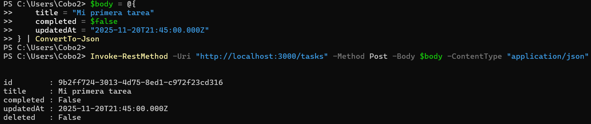
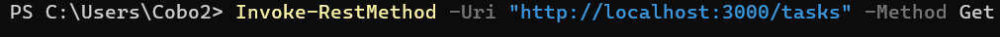
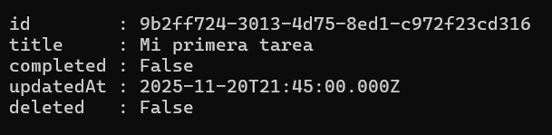
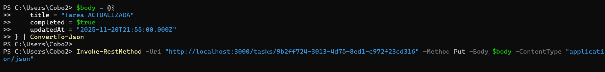
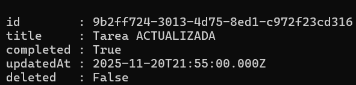
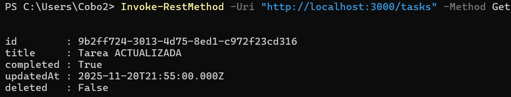

# TaskFlow API

API REST para el sistema de gestión de tareas con persistencia local y sincronización.

## Requisitos

- Node.js 18+
- npm o yarn

## Instalación

```bash
# Instalar dependencias
npm install
```

## Ejecución

### Desarrollo (con recarga automática)
```bash
npm run dev
```

### Producción
```bash
npm start
```

## Guía de Uso

### 1. Verificar estado del servidor
```bash
GET /health
```


### 2. Crear una tarea (POST)
```bash
POST /tasks
{
  "title": "Mi primera tarea",
  "completed": false,
  "updatedAt": "2025-11-20T21:45:00.000Z"
}
```


### 3. Listar todas las tareas (GET)
```bash
GET /tasks
```


### 4. Obtener una tarea por ID (GET)
```bash
GET /tasks/:id
```


### 5. Actualizar una tarea (PUT)
```bash
PUT /tasks/:id
{
  "title": "Tarea actualizada",
  "completed": true,
  "updatedAt": "2025-11-20T21:50:00.000Z"
}
```


### 6. Eliminar una tarea (DELETE)
```bash
DELETE /tasks/:id
```


## Estructura de Datos

### Tarea
```typescript
{
  id: string;          // ID único de la tarea
  title: string;       // Título de la tarea
  completed: boolean;  // Estado de completado
  updatedAt: string;   // Fecha de última actualización (ISO 8601)
  deleted: boolean;    // Indica si la tarea fue eliminada (soft delete)
}
```

## Ejemplos de Uso con PowerShell

### Crear tarea
```powershell
$body = @{
    title = "Tarea de ejemplo"
    completed = $false
    updatedAt = (Get-Date).ToUniversalTime().ToString("o")
} | ConvertTo-Json

Invoke-RestMethod -Uri "http://localhost:3000/tasks" -Method Post -Body $body -ContentType "application/json"
```

### Listar tareas
```powershell
Invoke-RestMethod -Uri "http://localhost:3000/tasks" -Method Get | ConvertTo-Json
```
